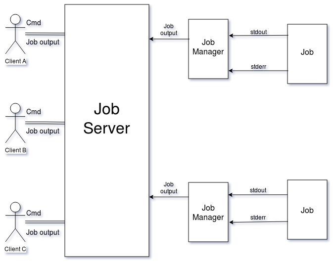

# jobserver

## Abstract
Host a TCP server with multi-client support that invokes jobs upon the clients request. The server maintains a log of its activation and de-activation time, all of the commands it receives and all the job output it sends. Clients can run a variety of commands, watch or kill active jobs or even request a new job for the server to run.

## How to Use
Navigate to the projects directory, then issue the following command to build the executables needed to run the jobserver.

Two executables will be made, jobserver and jobclient, the server and client respectively. 

Now, first launch the jobserver by issuing the following command:

The server should display the date and time of activation, and will now be running and awaiting connections. Anytime you need to kill the server, simply issue SIGINT (Ctrl+C) and the server will close. If the server receives another terminal signal other than SIGINT, the server will skip the proper shutdown procedure.

Open a new terminal and navigate to the projects directory, an issue the following command to run and connect the client to the server:

Now, you will be connected to the server and will be ready to begin issuing commands. Repeat the process of running the jobclient as many times as you wish.

To close the jobserver, kill the server with SIGINT (Ctrl+C). All connected clients should of recognized the server's deactivation and exited, but if a client is still active, issue the "exit" command (within the jobclient process) to close it.

To clean up the project folder, issue the following command to remove all object and executable files.

## How it Works
Main Design Structure:  

When a client connects to the server and requests a job, the server first creates a "Job Manager" then the job itself. The "Job Manager"
collects all output from the job, formats it, then notifies the server to distribute the output to all the watchers of the job. When a
job ends or is killed, the "Job Manager" collects (or kills and collects) the exit code of the job, notifies the server, then exits.

## Features Currently Supported
### Jobs
#### randprint [arg]
Writes "A stitch in time" arg times to stdout in random sized pieces on random intervals of time ("packets"), or a usage message
to stderr.

#### pfact [arg]
Using the Sieve algorithm, each prime less than the root of [arg] is filtered until the program either determines:  
1) arg is the product of exactly two primes  
2) arg is NOT the product of exactly two primes  
3) arg itself is prime

#### print_ptree [arg]
print_ptree explores the /proc/ directory beginning at PID [arg], building and displaying a tree of children processes rooted at [arg]. Each node in the tree contains:  
1) PID of the process  
2) the process name  

### Commands
The client can request any of the following commands from the server:  
#### jobs
Receive a list of all the active jobs currently running on the server, or an appropriate message if no jobs are currently running.
#### joblist  
Receive a list of all the possible jobs that the server can run, how to execute them, and what they do.  
#### watch [pid]
Recieve all the output of the job specified by pid. The number of clients watching a job is not bounded. If the client is already watching the job, removing the client from watching status.
#### kill [pid]
Kill the job specified by pid, notifing all of the clients watching of the job's termination.
#### run [jobname] [args](0 or more)
Begin running the job "jobname" with the given args, and become the first client watching the job. The number of jobs that the server can maintain is bounded by 32, so requests that exceed this number will be declined.
#### exit
Close your connection with the server and exit. (Server will still be active)
